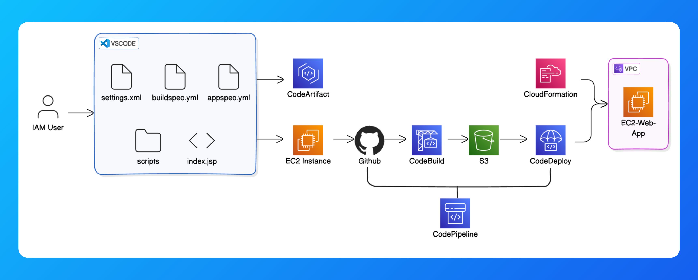

# CI/CD Pipeline & DevOps Automation with AWS
This project is part of a 7-part DevOps series, where I implemented a fully automated CI/CD pipeline for an AWS-based web application.



## ⚠️ Problem Statment  
Manual deployments are slow, error-prone, and can cause downtime.  

## 📈 Business Impact   
✅ Eliminates manual deployments and speeds up software delivery.  
✅ Reduces downtime & risk by testing infrastructure before deployment.  
✅ Ensures dev/prod parity—code behaves the same in all environments.  

## 🏢 How Companies Use This  
Any company doing frequent deployments (e.g., SaaS companies, fintech) benefits from automated pipelines.
<br>

## Table of Contents
- [Technologies Used](#technologies-used)
- [Setup and Deployment](#setup-and-deployment)
- [Challenges Faced](#challenges-faced)
- [Key Learnings](#key-learnings)
- [Future Enhancements](#future-enhancements)
- [Contact](#contact)

<br>

## Technologies Used

- Version Control: Git, GitHub
- CI/CD Automation: AWS CodePipeline, CodeBuild, CodeDeploy, CodeArtifact
- Infrastructure as Code (IaC): AWS CloudFormation
- Development: VSCode, AWS EC2 (for development environment)
- Automation & Scripting: AWS CLI

<br>

## Setup and Deployment
To set up this project on your local machine:

1. Clone the repository:
    ```bash
    git clone https://github.com/joeycloudio/nextwork-devops-webapp.git
    ```
2. Navigate to the project directory:
    ```bash
    cd nextwork-devops-webapp
    ```
3. Install dependencies:
    ```bash
    mvn install
    ```
4. Deploy using AWS CodePipeline:
- Connect GitHub to AWS CodePipeline.
- Define build and deployment stages using AWS services.

<br>

## Challenges Faced
⚠️ Frequent EC2 connection timeouts → Resolved by restarting VSCode and rebooting the instance.<br>
⚠️ Git authentication issue → Explored credential storage with git config --global credential.helper store.<br>
⚠️ CodeArtifact Setup Delays → Adjusted the pipeline to handle dependency storage efficiently.

<br>

## Key Learnings
✔️ Built a full CI/CD pipeline from scratch using AWS services.<br>
✔️ Mastered GitHub integration with AWS CodePipeline.<br>
✔️ Implemented automated deployments and rollback strategies with CodeDeploy.<br>
✔️ Used CloudFormation to provision infrastructure automatically.

<br>

## Future Enhancements
📌 Add monitoring & logging with AWS CloudWatch.<br>
📌 Implement IAM security best practices for pipeline access control.<br>
📌 Extend the pipeline to support multi-environment deployments (Dev → Staging → Prod).

<br>

## Contact

*   Email: joeyacostax@gmail.com

*   [LinkedIn](https://www.linkedin.com/in/joeyacosta/)
    
*   [Portfolio & Other AWS Projects](https://learn.nextwork.org/portfolio)
